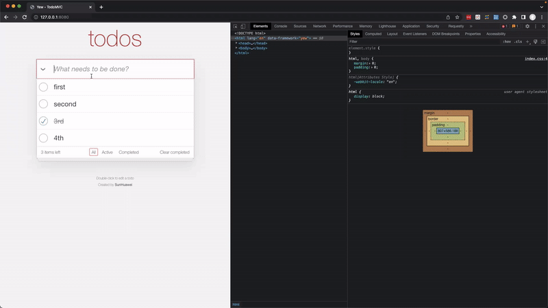

# What's this?

It's a [TodoMVC](https://todomvc.com/) style app written in [Rust](https://www.rust-lang.org/) with [yew](https://yew.rs/).

# Screen Recording



# Run on local

1. Clone this repo
2. Setup Rust + Yew env by this [instruction](https://yew.rs/docs/getting-started/introduction)
3. `trunk serve`
4. Visit http://127.0.0.1:8080 on your browser

# Deploy

```
deploy.sh
```

It's going to deploy the `dist/` to https://yew-todomvc-sunhuawei-stone-playground.vercel.app/.
